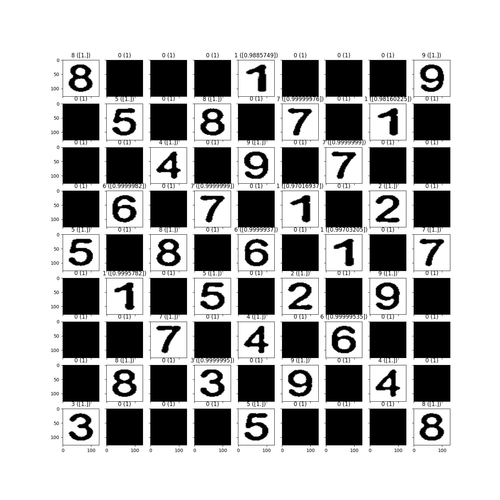

# Sudoku Solver with Streamlit Interface

This project is a computer vision-based Sudoku Solver that uses a Convolutional Neural Network (CNN) to identify and solve puzzles from uploaded images. The application is built with Streamlit, providing an intuitive web interface where users can upload unsolved Sudoku images, view the solutions, and download the solved puzzles.

## Features

- **Image Upload**: Users can upload images of unsolved Sudoku puzzles.
- **Instant Solving**: The app processes the image, extracts digits, solves the puzzle, and overlays the solution on the original grid.
- **Downloadable Solution**: Solved Sudoku puzzles can be downloaded with a single click.

## How It Works

1. **Digit Extraction**: The CNN model identifies and extracts digits from the Sudoku grid in the uploaded image.
2. **Solving Algorithm**: The solver algorithm solves the puzzle based on the extracted digits.
3. **Result Display**: The solution is displayed overlaid on the original grid, and users can download the solved image.

## Installation

1. Clone the repository:
   ```bash
   git clone https://github.com/silent-learner/ai-sudoku-solver.git
   ```
2. Navigate to the project directory:
   ```bash
   cd sudoku-solver
   ```
3. Install required dependencies:
   ```bash
   pip install -r requirements.txt
   ```
4. Run the Streamlit app:
   ```bash
   streamlit run streamlit_app.py
   ```

## Usage

- Open the app in your web browser [Localhost](http://localhost:8051).
- Upload an image of an unsolved Sudoku puzzle.
- Click the "Solve Sudoku" button to generate the solution.
- Download the solved Sudoku image.

## Technologies Used

- **Python**
- **OpenCV** for image processing
- **CNN** for digit recognition
- **Streamlit** for the web interface
- **PIL** for image handling
- **Dataset Used** [Kaggle link](https://www.kaggle.com/datasets/karnikakapoor/digits)

## Intermediate Outputs





